# JavaWeb项目部署到tomcat

### 一、环境配置

1. 开发IDE:安装IntelliJ IDEA 2020.1最终版

2. JDK版本:1.8

3. Maven版本:3.6+

4. 环境配置要求:

> - 配置Java和Mvn系统环境变量
> - 配置Maven镜像和仓库目录
> - IDEA项目导入全局配置及SDK版本配置

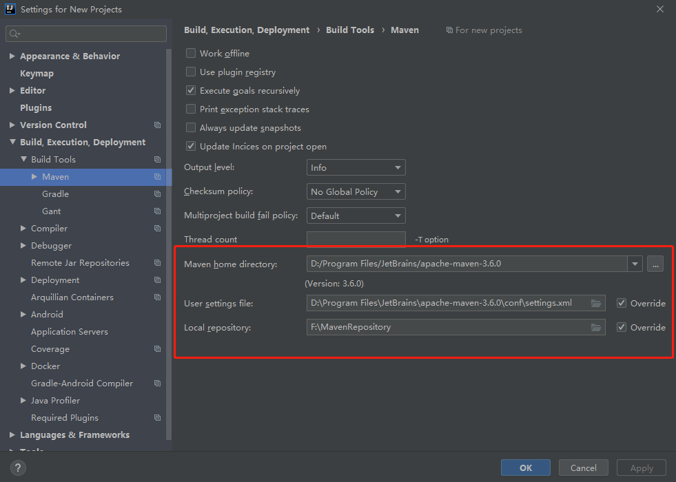

### 二、创建原型示例项目.

1.相关配置完成之后,打开IDEA,按操作顺序创建新的webapp项目,新项目采用IDEA自带的原型示例:`maven-archetype-webapp`,点击下一步,

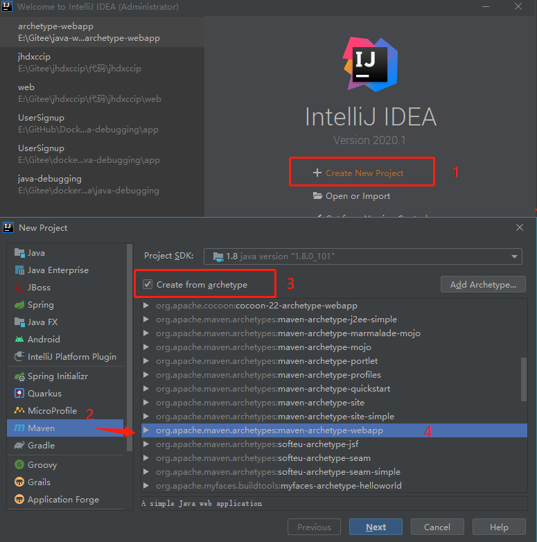

2.填写项目名称和项目存放地址，配置项目GroupId、ArticfactId以及版本Version,点击下一步

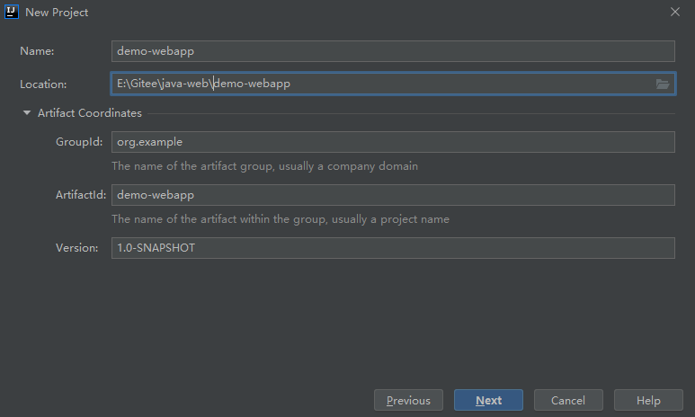

3.配置Maven目录及相关配置，默认会继承全局配置，可以不做任何更改，点击完成

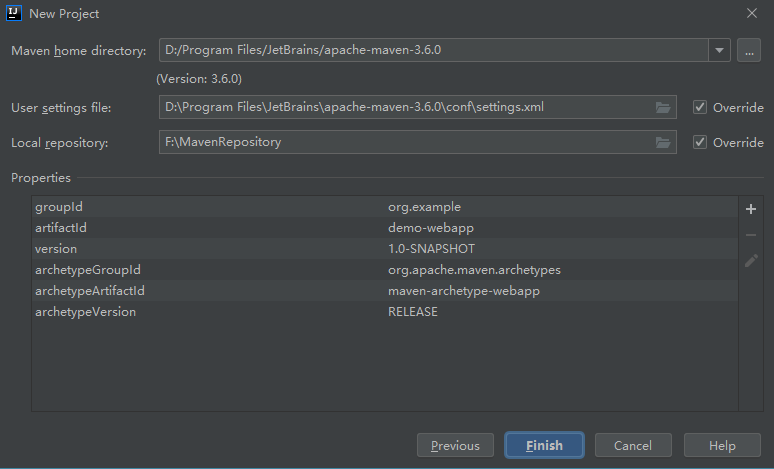

4.项目创建之后，打开工具栏Project Stucture按钮,打开Project Settings---->Modules并配置项目目录属性

**新建java和resources文件夹**

把java文件夹设置为Sources，用于保存java代码，Mark as设置完成后文件夹会变成蓝色
recources文件夹：一般用来存放一些资源文件,Mark之后文件夹变成紫色
webapp文件夹：用来存放web配置文件以及jsp页面等

注：target目录是在maven打包的时候才会生成的，一开始是没有这个目录的，属于excluded目录

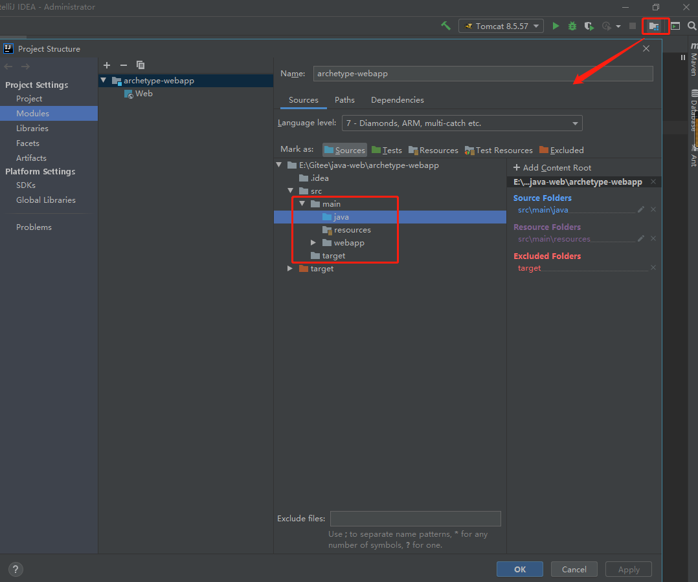

5.目录配置完成后的项目结构如图所示:

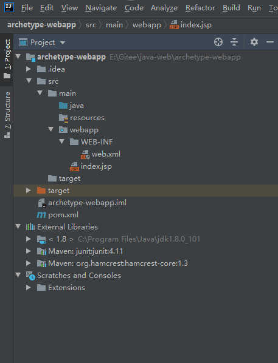

### 三、IDEA配置Tomcat服务器

1.创建完项目之后，点击工具栏Edit Configurations，配置Tomcat,默认无任何配置

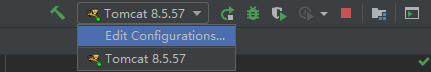

2.点击加号，添加新配置：Tomcat Server-->Local

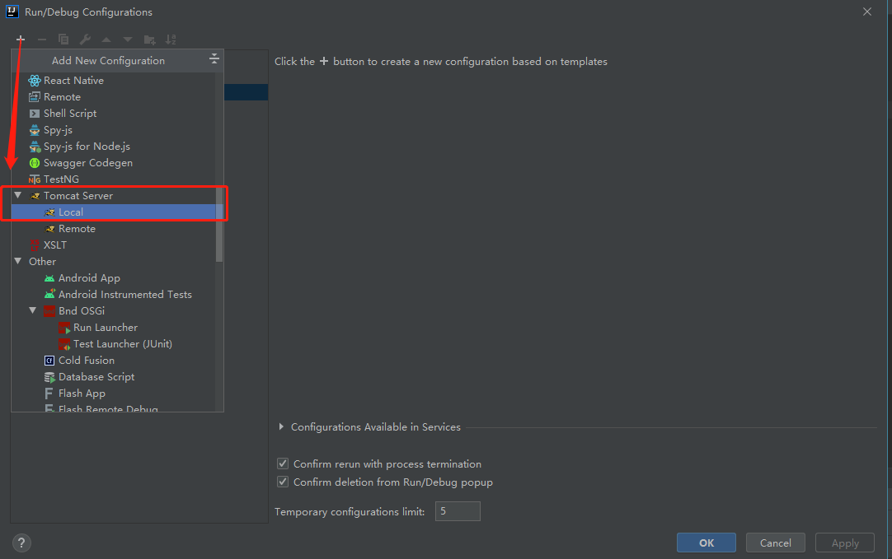

3.配置Tomcat服务器(提前从官网下载Tomcat 版本8.5+到本地目录),选择根目录即可

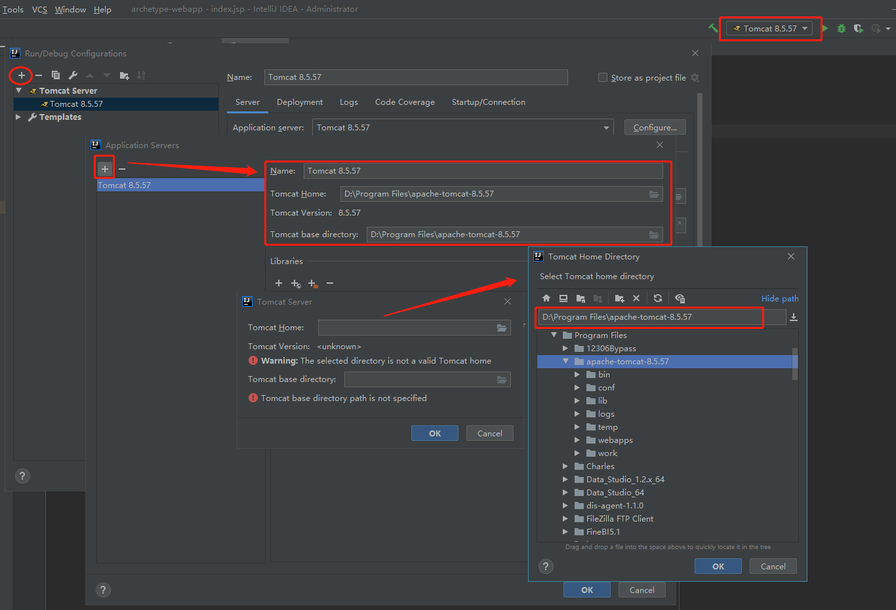

4.Tomcat服务器添加完成之后，再配置java版本及web服务访问端口(与本机不冲突即可，本示例用8124端口)

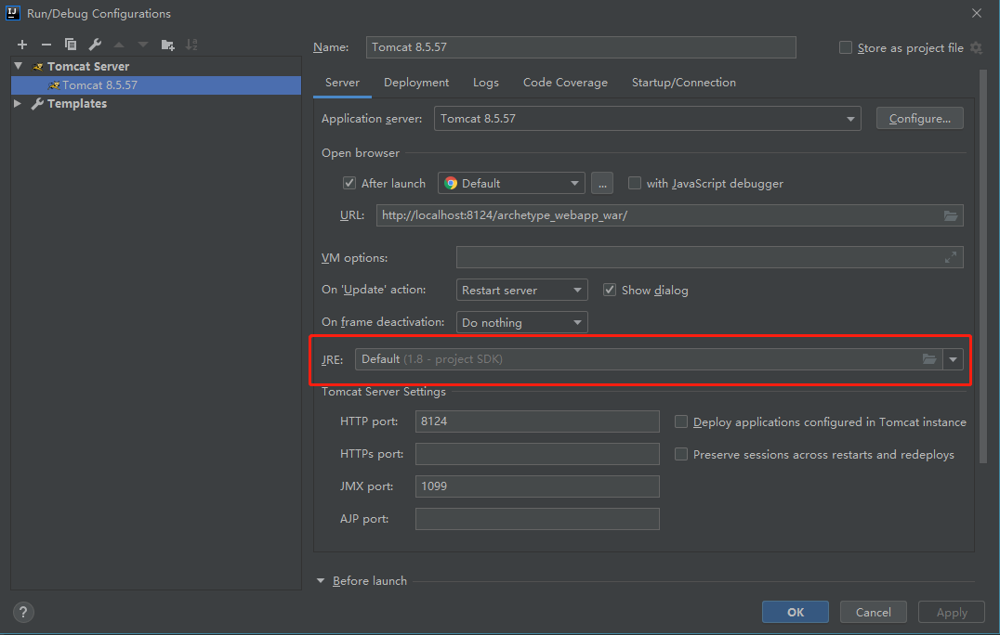

5. 配置tomcat 启动项目的Artifact,采用war包的方式进行部署

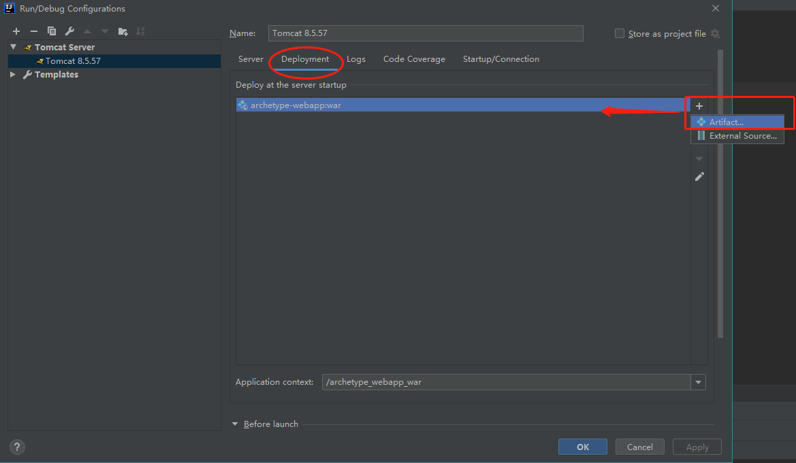

### 四、Maven打包构建项目

1.打开右侧Maven窗口，点击Lifecycle--->verify---双击或运行Run Maven build

2.验证项目包是否能正常编译和构建

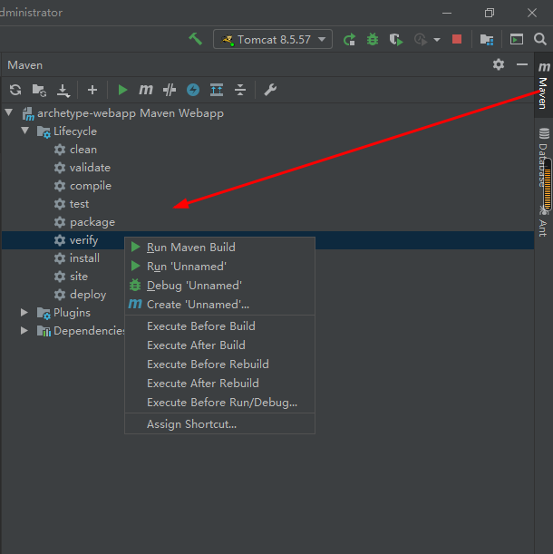

3.控制台输出日志显示成功构建war包的路径

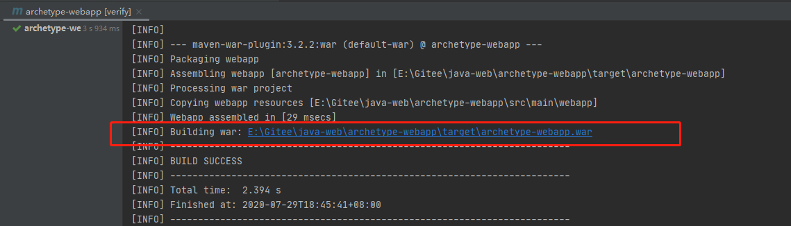

4.项目的target目录会显示构建好的相关文件

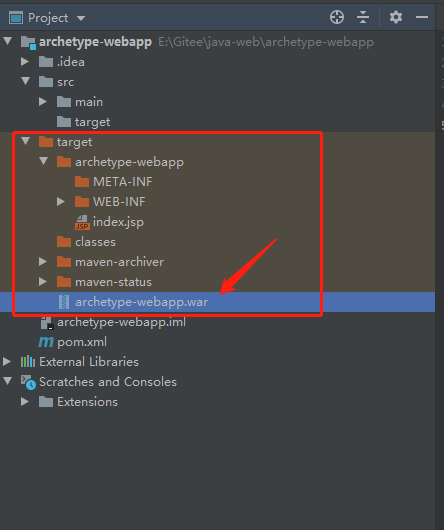

### 五、启动web项目

1.将生成好的war文件复制到tomcat下的webaps目录下

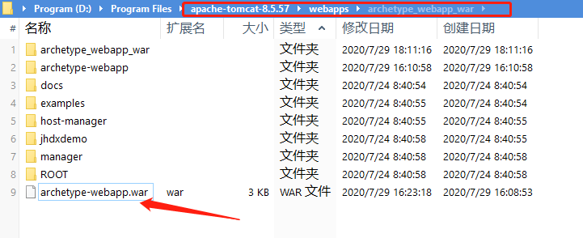

2.点击工具栏三角形启动Tomcat 服务器，会自动启动之前配置好的浏览器，并打开访问地址,成功显示web页面.

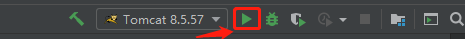

### 六、日志乱码解决

1.乱码的地方

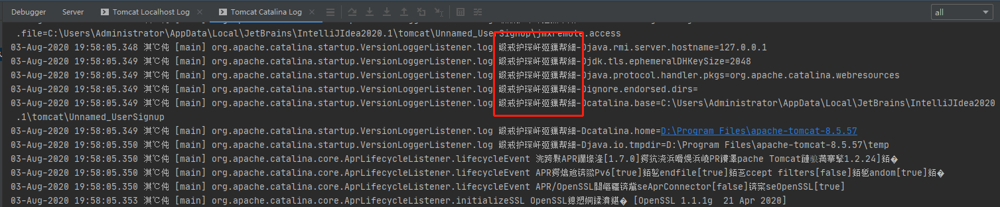

 

2.解决方法

打开Tomcat安装路径的tomcat/conf/目录下的修改logging.properties

**Output乱码解决**

找到java.util.logging.ConsoleHandler.encoding = UTF-8

将其**注释掉**

\#java.util.logging.ConsoleHandler.encoding = UTF-8

或者将**UTF-8改为GBK**

java.util.logging.ConsoleHandler.encoding = GBK

 

**Tomcat Localhost Log 乱码解决**

找到localhost.org.apache.juli.AsyncFileHandler.encoding = UTF-8

将其**注释掉**

\#localhost.org.apache.juli.AsyncFileHandler.encoding = UTF-8

或者将**UTF-8改为GBK**

localhost.org.apache.juli.AsyncFileHandler.encoding = GBK

 

**Tomcat Catania Log 乱码解决**

找到catalina.org.apache.juli.AsyncFileHandler.encoding = UTF-8

将其**注释掉**

\#catalina.org.apache.juli.AsyncFileHandler.encoding = UTF-8

或者将**UTF-8改为GBK**

catalina.org.apache.juli.AsyncFileHandler.encoding = GBK