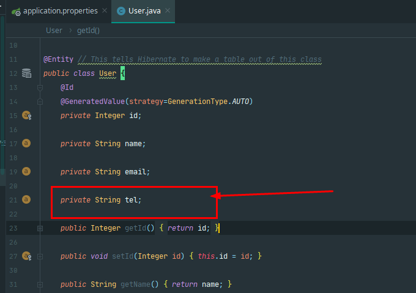

# Spring Boot打包部署篇

### Jar包、配置文件、依赖包分开打包


由于每次以jar包方式部署会有上面说的缺点，为了解决这些问题，可以将jar包、配置文件、依赖包分开打包。分开打包后，有如下好处：

1、可以实现当依赖包有变化时，才重新打包依赖包

2、配置文件也可以修改

3、由于依赖包和jar包分离，可以减少jar文件大小。jar文件减少，可以缩短上传到服务器的时间

 第一步：pom文件修改如下：

```xml
<?xml version="1.0" encoding="UTF-8"?>
<project xmlns="http://maven.apache.org/POM/4.0.0" xmlns:xsi="http://www.w3.org/2001/XMLSchema-instance"
         xsi:schemaLocation="http://maven.apache.org/POM/4.0.0 http://maven.apache.org/xsd/maven-4.0.0.xsd">
    <modelVersion>4.0.0</modelVersion>

    <groupId>com.lnjecit</groupId>
    <artifactId>springboot-helloworld</artifactId>
    <version>0.0.1-SNAPSHOT</version>
    <packaging>jar</packaging>

    <name>springboot-helloworld</name>
    <description>Demo project for Spring Boot</description>

    <parent>
        <groupId>org.springframework.boot</groupId>
        <artifactId>spring-boot-starter-parent</artifactId>
        <version>1.5.8.RELEASE</version>
        <relativePath/> <!-- lookup parent from repository -->
    </parent>

    <properties>
        <project.build.sourceEncoding>UTF-8</project.build.sourceEncoding>
        <project.reporting.outputEncoding>UTF-8</project.reporting.outputEncoding>
        <java.version>1.8</java.version>
    </properties>

    <dependencies>
        <dependency>
            <groupId>org.springframework.boot</groupId>
            <artifactId>spring-boot-starter-web</artifactId>
        </dependency>

        <dependency>
            <groupId>org.springframework.boot</groupId>
            <artifactId>spring-boot-starter-test</artifactId>
            <scope>test</scope>
        </dependency>
    </dependencies>

    <build>
        <plugins>
            <!--<plugin>
                <groupId>org.springframework.boot</groupId>
                <artifactId>spring-boot-maven-plugin</artifactId>
            </plugin>-->

            <plugin>
                <groupId>org.apache.maven.plugins</groupId>
                <artifactId>maven-jar-plugin</artifactId>
                <configuration>
                    <excludes>
                        <exclude>*.properties</exclude>
                        <exclude>*.yml</exclude>
                    </excludes>
                    <archive>
                        <manifest>
                            <!-- 为依赖包添加路径, 这些路径会写在MANIFEST文件的Class-Path下 -->
                            <mainClass>com.lnjecit.springboothelloworld.SpringbootHelloworldApplication</mainClass>
                            <addClasspath>true</addClasspath>
                            <classpathPrefix>lib/</classpathPrefix>
                            <!-- 打包时 MANIFEST.MF文件不记录的时间戳版本 -->
                            <useUniqueVersions>false</useUniqueVersions>
                        </manifest>
                        <manifestEntries>
                            <!-- 在Class-Path下添加配置文件的路径 -->
                            <Class-Path>config/</Class-Path>
                        </manifestEntries>
                    </archive>
                </configuration>
            </plugin>
            <plugin>
                <artifactId>maven-resources-plugin</artifactId>
                <executions>
                    <execution>
                        <id>copy-xmls</id>
                        <phase>process-sources</phase>
                        <goals>
                            <goal>copy-resources</goal>
                        </goals>
                        <configuration>
                            <outputDirectory>${basedir}/target/config</outputDirectory>
                            <resources>
                                <resource>
                                    <directory>${basedir}/src/main/resources</directory>
                                    <includes>
                                        <include>*.properties</include>
                                        <include>*.yml</include>
                                    </includes>
                                </resource>
                            </resources>
                        </configuration>
                    </execution>
                </executions>
            </plugin>
            <plugin>
                <groupId>org.apache.maven.plugins</groupId>
                <artifactId>maven-dependency-plugin</artifactId>
                <executions>
                    <execution>
                        <id>copy</id>
                        <phase>package</phase>
                        <goals>
                            <goal>copy-dependencies</goal>
                        </goals>
                        <configuration>
                            <outputDirectory>target/lib/</outputDirectory>
                        </configuration>
                    </execution>
                </executions>
            </plugin>
        </plugins>
    </build>


</project>
```

第二步：在idea中Terminal控制台执行maven打包命令

```bash
mvn clean package -Dmaven.test.skip=true
```

命令执行完毕后，在target目录下生成了jar包、config、lib三部分，如下图：


 第三步：使用xftp将jar包上传到服务器/usr/local/springboot-helloworld/deploy目录下


 

第四步：运行jar包

先切换到jar包所在目录：

```
cd /usr/local/springboot-helloworld/deploy/
```

 

springboot默认启动端口为8080，为了测试分开打包后可以修改配置文件，在application.properties文件中修改启动端口为3003


 

运行jar:

```
java -jar springboot-helloworld-0.0.1-SNAPSHOT.jar
```

 

 在控制台可以看到启动端口变成了3003，如下图Tomcat started on port(s):3003：


第五步：创建数据库对应的应用账号

```sql
mysql> create user 'springuser'@'%' identified by 'ThePassword'; -- Creates the user

mysql> grant all on db_example.* to 'springuser'@'%'; -- Gives all privileges to the new user on the newly created database

mysql> revoke all on db_example.* from 'springuser'@'%';

mysql> grant select, insert, delete, update,alter on db_example.* to 'springuser'@'%';

```


修改源代码User实体类，添加tel字段，重新构建发布包，并只上传jar包到服务器，停止之前的进程，再次运行之后发现，数据字段已更新;



