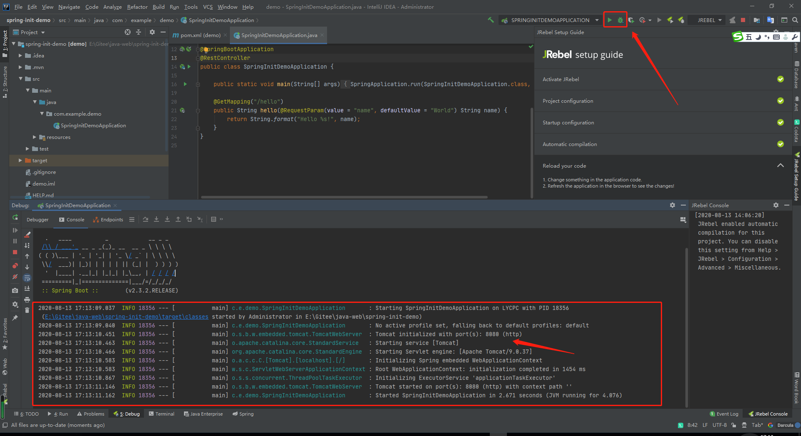

# Spring Quickstart Guide

## What you'll build

You will build a classic “Hello World!” endpoint which any browser can connect to. You can even tell it your name, and it will respond in a more friendly way.

## What you’ll need

An Integrated Developer Environment (IDE)

Popular choices include [IntelliJ IDEA](https://www.jetbrains.com/idea/), [Spring Tools](https://spring.io/tools), [Visual Studio Code](https://code.visualstudio.com/docs/languages/java), or [Eclipse](https://www.eclipse.org/downloads/packages/), and many more.

A Java™ Development Kit (JDK)

We recommend [AdoptOpenJDK](https://adoptopenjdk.net/) version 8 or version 11.

## Step 1: Start a new Spring Boot project

Use [start.spring.io](https://start.spring.io/) to create a “web” project. In the “Dependencies” dialog search for and add the “web” dependency as shown in the screenshot. Hit the “Generate” button, download the zip, and unpack it into a folder on your computer.


Projects created by [start.spring.io](https://start.spring.io/) contain [Spring Boot](https://spring.io/projects/spring-boot), a framework that makes Spring ready to work inside your app, but without much code or configuration required. Spring Boot is the quickest and most popular way to start Spring projects.

## Step 2: Add your code

Open up the project in your IDE and locate the `DemoApplication.java` file in the `src/main/java/com/example/demo` folder. Now change the contents of the file by adding the extra method and annotations shown in the code below. You can copy and paste the code or just type it.

```java
package com.example.demo;

import org.springframework.boot.SpringApplication;
import org.springframework.boot.autoconfigure.SpringBootApplication;
import org.springframework.web.bind.annotation.GetMapping;
import org.springframework.web.bind.annotation.RequestParam;
import org.springframework.web.bind.annotation.RestController;

@SpringBootApplication
@RestController
public class DemoApplication {


public static void main(String[] args) {

SpringApplication.run(DemoApplication.class, args);
}

@GetMapping("/hello")
public String hello(@RequestParam(value = "name", defaultValue = "World") String name) {

return String.format("Hello %s!", name);
}
}
COPY
```

This is all the code required to create a simple “Hello World” web service in Spring Boot.

The `hello()` method we’ve added is designed to take a String parameter called `name`, and then combine this parameter with the word `"Hello"` in the code. This means that if you set your name to `“Amy”` in the request, the response would be `“Hello Amy”`.

The `@RestController` annotation tells Spring that this code describes an endpoint that should be made available over the web. The `@GetMapping(“/hello”)` tells Spring to use our `hello()` method to answer requests that get sent to the `http://localhost:8080/hello` address. Finally, the `@RequestParam` is telling Spring to expect a `name` value in the request, but if it’s not there, it will use the word “World” by default.

## Step 3: Try it

Let’s build and run the program. Open a command line (or terminal) and navigate to the folder where you have the project files. We can build and run the application by issuing the following command:

**MacOS/Linux:**

```
./mvnw spring-boot:run
```


**Windows:**

```
mvnw spring-boot:run
```


You should see some output that looks very similar to this:


**IDEA:**



The last couple of lines here tell us that Spring has started. Spring Boot’s embedded Apache Tomcat server is acting as a webserver and is listening for requests on `localhost` port `8080`. Open your browser and in the address bar at the top enter http://localhost:8080/hello. You should get a nice friendly response like this:


### Pop quiz

What should happen if you add `?name=Amy` to the end of the URL?