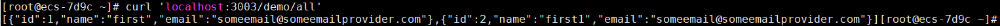

# Spring Boot打包部署篇

### Jar包、配置文件、依赖包分开打包


由于每次以jar包方式部署会有上面说的缺点，为了解决这些问题，可以将jar包、配置文件、依赖包分开打包。分开打包后，有如下好处：

1、可以实现当依赖包有变化时，才重新打包依赖包

2、配置文件也可以修改

3、由于依赖包和jar包分离，可以减少jar文件大小。jar文件减少，可以缩短上传到服务器的时间

 第一步：pom文件修改如下：

```xml
<?xml version="1.0" encoding="UTF-8"?>
<project xmlns="http://maven.apache.org/POM/4.0.0"
         xmlns:xsi="http://www.w3.org/2001/XMLSchema-instance"
         xsi:schemaLocation="http://maven.apache.org/POM/4.0.0 http://maven.apache.org/xsd/maven-4.0.0.xsd">
    <modelVersion>4.0.0</modelVersion>
    <groupId>com.jltechcn</groupId>
    <artifactId>jhdxccip</artifactId>
    <packaging>pom</packaging>
    <version>1.0-SNAPSHOT</version>
    <properties>
        <project.build.sourceEncoding>UTF-8</project.build.sourceEncoding>
        <jdk.version>1.8</jdk.version>
        <maven.test.skip>true</maven.test.skip>
    </properties>
    <dependencyManagement>
        <dependencies>
            <dependency>
                <groupId>org.springframework.boot</groupId>
                <artifactId>spring-boot-starter-web</artifactId>
                <version>1.5.10.RELEASE</version>
                <type>pom</type>
                <scope>import</scope>
            </dependency>
        </dependencies>
    </dependencyManagement>
    <modules>
        <module>web</module>
    </modules>
    <!-- 构建发布包，将tar,lib,resource,properties配置分离构建 -->
    <build>
        <plugins>
            <plugin>
                <groupId>org.apache.maven.plugins</groupId>
                <artifactId>maven-compiler-plugin</artifactId>
                <version>3.1</version>
                <configuration>
                    <source>${jdk.version}</source>
                    <target>${jdk.version}</target>
                    <compilerVersion>${jdk.version}</compilerVersion>
                    <encoding>UTF-8</encoding>
                </configuration>
            </plugin>
            <!-- 构建jar包-->
            <plugin>
                <groupId>org.apache.maven.plugins</groupId>
                <artifactId>maven-jar-plugin</artifactId>
                <version>3.2.0</version>
                <configuration>
                    <excludes>
                        <exclude>*.properties</exclude>
                        <exclude>*.yml</exclude>
                    </excludes>
                    <archive>
                        <manifest>
                            <!-- 为依赖包添加路径, 这些路径会写在MANIFEST文件的Class-Path下 -->
                            <mainClass>com.jltechcn.core.SpringApplications</mainClass>
                            <addClasspath>true</addClasspath>
                            <classpathPrefix>lib/</classpathPrefix>
                            <!-- 打包时 MANIFEST.MF文件不记录的时间戳版本 -->
                            <useUniqueVersions>false</useUniqueVersions>
                        </manifest>
                        <manifestEntries>
                            <!-- 在Class-Path下添加配置文件的路径 -->
                            <Class-Path>resources/</Class-Path>
                        </manifestEntries>
                    </archive>
                </configuration>
            </plugin>
            <!-- 构建resources文件 -->
            <plugin>
                <groupId>org.apache.maven.plugins</groupId>
                <artifactId>maven-resources-plugin</artifactId>
                <version>3.2.0</version>
                <executions>
                    <execution>
                        <id>copy-properties</id>
                        <phase>process-sources</phase>
                        <goals>
                            <goal>copy-resources</goal>
                        </goals>
                        <configuration>
                            <outputDirectory>${basedir}/target/resources</outputDirectory>
                            <resources>
                                <resource>
                                    <directory>${basedir}/src/main/resources</directory>
                                </resource>
                            </resources>
                        </configuration>
                    </execution>
                </executions>
            </plugin>
            <!-- 构建依赖包文件 -->
            <plugin>
                <groupId>org.apache.maven.plugins</groupId>
                <artifactId>maven-dependency-plugin</artifactId>
                <executions>
                    <execution>
                        <id>copy</id>
                        <phase>package</phase>
                        <goals>
                            <goal>copy-dependencies</goal>
                        </goals>
                        <configuration>
                            <outputDirectory>target/lib/</outputDirectory>
                        </configuration>
                    </execution>
                </executions>
            </plugin>
        </plugins>
    </build>
</project>
```

第二步：在idea中Terminal控制台执行maven打包命令

```bash
mvn clean package -Dmaven.test.skip=true
```

命令执行完毕后，在target目录下生成了jar包、config、lib三部分，如下图：


 第三步：使用xftp将jar包上传到服务器/usr/local/springboot-helloworld/deploy目录下


 

第四步：运行jar包

先切换到jar包所在目录：

```
cd /usr/local/springboot-helloworld/deploy/
```

 

springboot默认启动端口为8080，为了测试分开打包后可以修改配置文件，在application.properties文件中修改启动端口为3003


 

运行jar:

```
java -jar springboot-helloworld-0.0.1-SNAPSHOT.jar
```

 

 在控制台可以看到启动端口变成了3003，如下图Tomcat started on port(s):3003：


第五步：创建数据库对应的应用账号

### 更改权限

使用grant all privileges on来更改用户对应某些库的远程权限

#### 语法模板

grant all privileges on 库名.表名 to '用户名'@'IP地址' identified by '密码' with grant option;
flush privileges;

#### 注：

库名:要远程访问的数据库名称,所有的数据库使用“*”
表名:要远程访问的数据库下的表的名称，所有的表使用“*”
用户名:要赋给远程访问权限的用户名称
IP地址:可以远程访问的电脑的IP地址，所有的地址使用“%”
密码:要赋给远程访问权限的用户对应使用的密码


```sql
mysql> create user 'springuser'@'%' identified by 'password123'; -- Creates the user

mysql> grant all on db_example.* to 'springuser'@'%'; -- Gives all privileges to the new user on the newly created database

mysql> revoke all on db_example.* from 'springuser'@'%';

mysql> grant select, insert, delete, update,alter on db_example.* to 'springuser'@'%';

```

给springuser 数据库db_example所有权限 

```sql
mysql> grant all on db_example.* to 'springuser'@'%';
```

给root所有的权限 

```sql
mysql> grant all privileges on *.* to root@"%" identified by ".";
Query OK, 0 rows affected (0.00 sec)
```

备注：mysql5.7 客户端用IP访问，需要单独再给root设置一个与本地localhost不一样的登陆密码

```
mysql> GRANT ALL ON *.* TO root@'%' IDENTIFIED BY '123456'
mysql> flush privileges;
```



修改源代码User实体类，添加tel字段，重新构建发布包，并只上传jar包到服务器，停止之前的进程，再次运行之后发现，数据字段已更新;


**配置文件的优先级**

application.properties和application.yml文件可以放在一下四个位置：

- 外置，在相对于应用程序运行目录的/congfig子目录里。
- 外置，在应用程序运行的目录里
- 内置，在config包内
- 内置，在Classpath根目录

同样，这个列表按照优先级排序，也就是说，src/main/resources/config下application.properties覆盖src/main/resources下application.properties中相同的属性，如图： 


 

此外，如果你在相同优先级位置同时有application.properties和application.yml，那么application.yml里面的属性就会覆盖application.properties里的属性。

## Profile-多环境配置

当应用程序需要部署到不同运行环境时，一些配置细节通常会有所不同，最简单的比如日志，生产日志会将日志级别设置为WARN或更高级别，并将日志写入日志文件，而开发的时候需要日志级别为DEBUG，日志输出到控制台即可。
如果按照以前的做法，就是每次发布的时候替换掉配置文件，这样太麻烦了，Spring Boot的Profile就给我们提供了解决方案，命令带上参数就搞定。

这里我们来模拟一下，只是简单的修改端口来测试
在Spring Boot中多环境配置文件名需要满足`application-{profile}.properties`的格式，其中`{profile}`对应你的环境标识，比如：

- application-dev.properties：开发环境

- application-prod.properties：生产环境

- 想要使用对应的环境，只需要在application.properties中使用spring.profiles.active属性来设置，值对应上面提到的{profile}，这里就是指dev、prod这2个。
  当然你也可以用命令行启动的时候带上参数：

  ```
  java -jar xxx.jar --spring.profiles.active=dev
  ```

除了spring.profiles.active来激活一个或者多个profile之外，还可以用spring.profiles.include来叠加profile

```
spring.profiles.active: testdb  
spring.profiles.include: proddb,prodmq
```

前台或后台运行

```
#前台运行，关闭窗口后退出
java -jar /jar包路径

#后台运行
nohup java -jar /jar包路径

#后台运行，指定启动日志记录文件
nohup java -jar /jar包路径 > /指定日志文件路径
nohup java -jar jhdxweb-1.0-SNAPSHOT.jar > ./logs/run.log 2>&1 &

```

### 查看应用是否启动

```
netstat -nltp
```


```
 jps -l
```


#### 一键启动脚本

新建run_jar.sh文件,内容如下 

```sh
#!/bin/bash
#--------------------------------------------
# Springboot项目jar包启动脚本
# author：yichaoo
# date:2020/9/18
# description:
# 脚本核心命令
# 后台启动进程:nohup java -jar jhdxweb-1.0-SNAPSHOT.jar > /logs/run.log 2>&1 &
#-------------------------------------------
##### 定义全局变量和函数 开始 #####

#定义全局变量jar包路径和项目名称(不带版本号)
#根据实际项目名称和路径进行更改
PROJECT_NAME=jhdxweb
JAR_HOME=/www/java_app/jhdx-web
RUN_LOG=logs/run.log
#定义函数变量
#获取当前项目jar包进程id
funGetJarPID(){  
   pid=`jps -l | grep ${PROJECT_NAME} | awk -F" " '{ print $1 }'`    
}

##### 全局变量配置区 结束  #####

echo "================begin====================="
echo "starting....."
funGetJarPID
echo "[INFO] 找到项目${PROJECT_NAME}的jar包进程${pid}"

while [ ${pid} ] 
do
    echo "[INFO] 正在结束项目${PROJECT_NAME}的jar包进程ID:${pid}....."
    if [ ${pid} ] 
    then
        kill -2 ${pid}
    fi
    funGetJarPID
done
echo "[INFO] 进程已结束"

echo "[INFO] 开始重新运行${JAR_HOME}目录下${PROJECT_NAME}*.jar包"
nohup java -jar ${JAR_HOME}/${PROJECT_NAME}*.jar > ${JAR_HOME}/${RUN_LOG} 2>&1 &
#如果命令执行成功，返回结果0
if [ $? == 0 ]
then
    until [ ${pid} ] 
    do
        funGetJarPID
        echo "[INFO] jar包进程创建中...."
    done    
    echo "[INFO] 进程已创建PID：${pid}"  
    echo "[INFO] 正在启动应用程序...."
    until [  -n "$tomcat_running_port" ]
    do
        tail_info=`tail -2 ${JAR_HOME}/${RUN_LOG} | awk -F" - " '{print $2}'`
        tomcat_running_port=`cat ${JAR_HOME}/${RUN_LOG} | grep 'Tomcat started' | awk -F" - " '{print $2}'` 
        echo "[INFO] ${tail_info}..." 
        sleep 2s
    done  
    
    echo "[INFO] 成功运行项目${PROJECT_NAME}的jar包:${tomcat_running_port}"
    echo "All success!"
else
   echo "[ERROR] 进程创建失败!"
fi
echo "================end====================="

```

