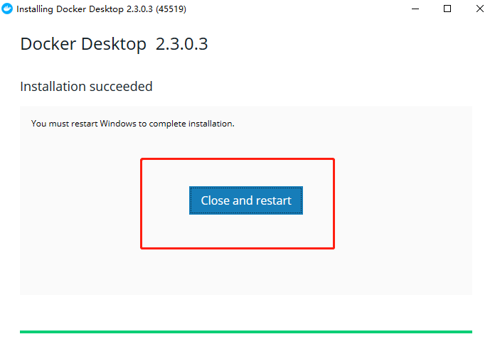
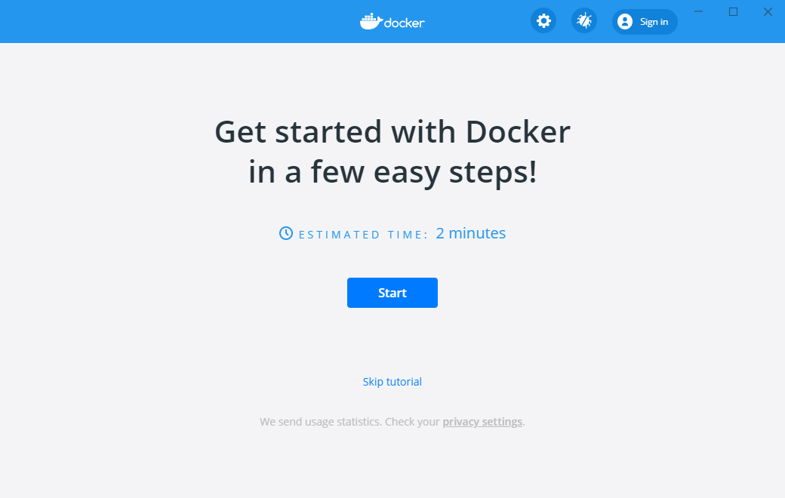
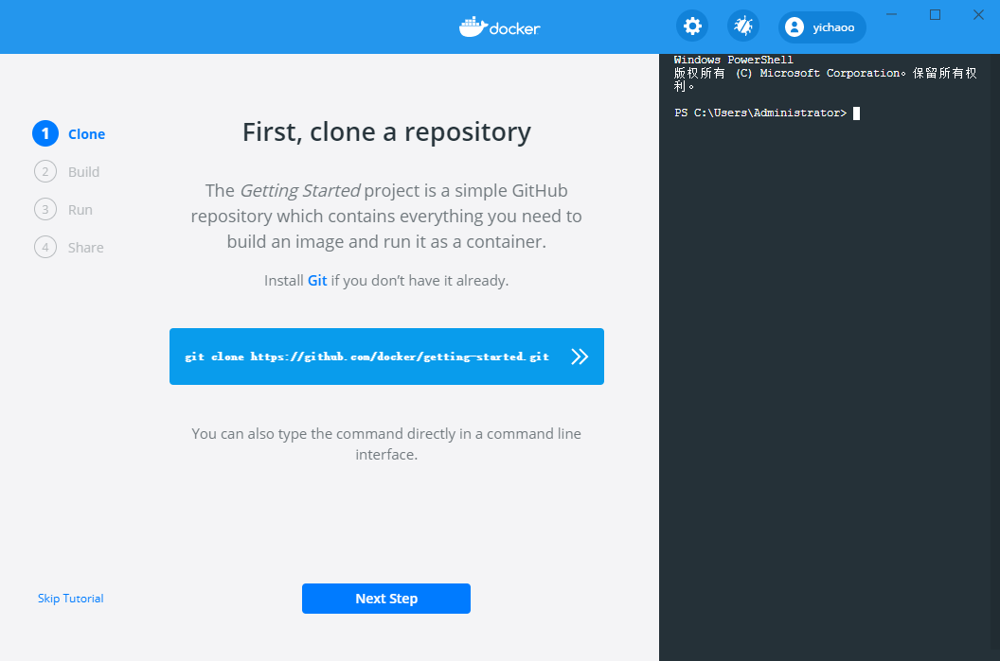
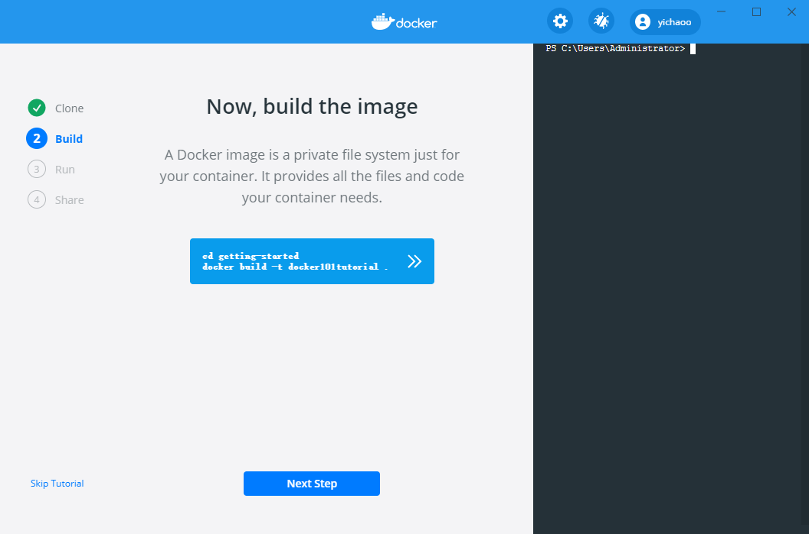
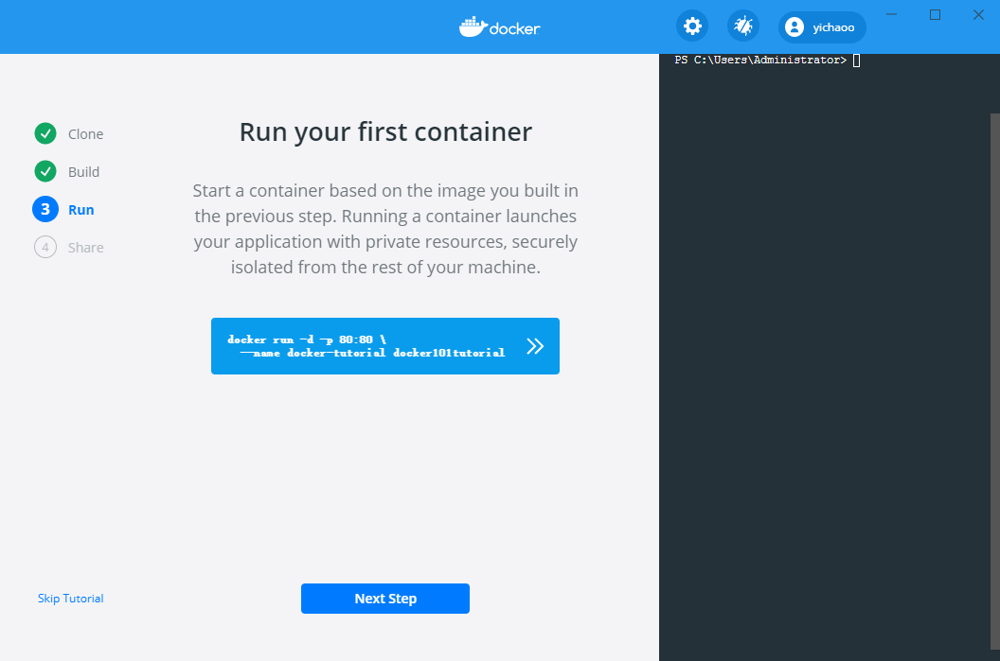
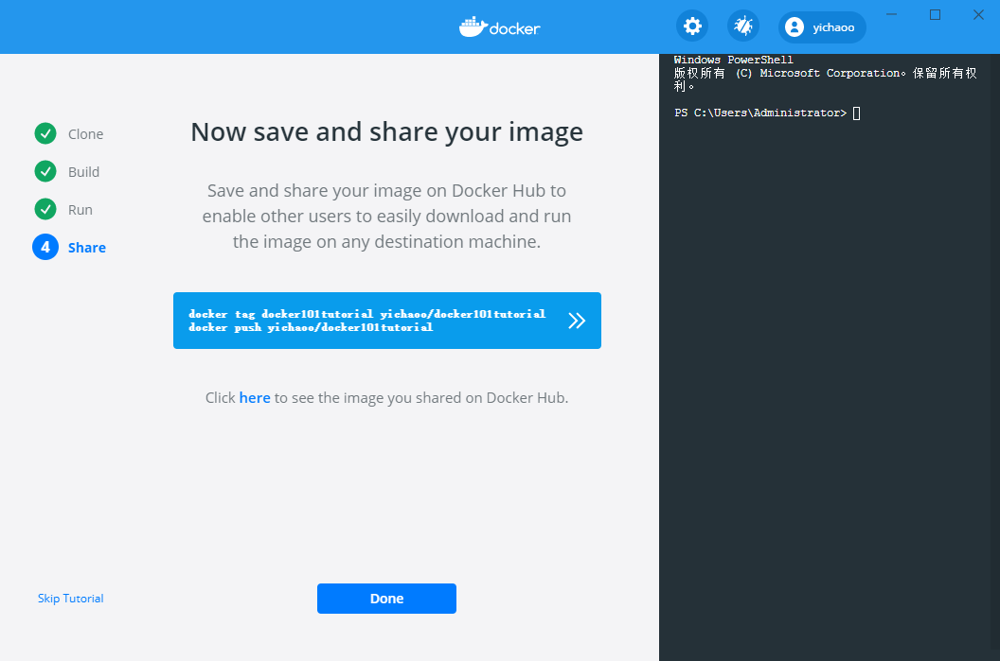
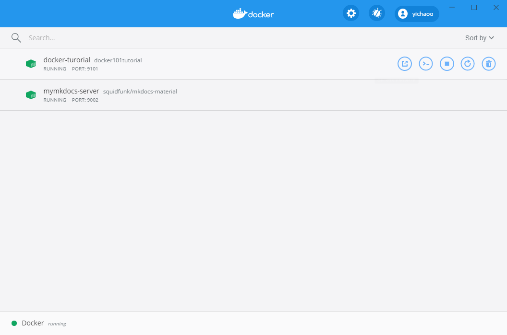

# 02.Docker Desktop-Window

## Install Docker Desktop on Windows

1. Double-click **Docker Desktop Installer.exe** to run the installer.

   If you haven’t already downloaded the installer (`Docker Desktop Installer.exe`), you can get it from [**Docker Hub**](https://hub.docker.com/editions/community/docker-ce-desktop-windows/). It typically downloads to your `Downloads` folder, or you can run it from the recent downloads bar at the bottom of your web browser.

2. When prompted, ensure the **Enable Hyper-V Windows Features** option is selected on the Configuration page.

3. Follow the instructions on the installation wizard to authorize the installer and proceed with the install.

4. When the installation is successful, click **Close** to complete the installation process.

5. If your admin account is different to your user account, you must add the user to the **docker-users** group. Run **Computer Management** as an administrator and navigate to **Local Users and Groups** > **Groups** > **docker-users**. Right-click to add the user to the group. Log out and log back in for the changes to take effect.

   

## Start Docker Desktop

Docker Desktop does not start automatically after installation. To start Docker Desktop, search for Docker, and select **Docker Desktop** in the search results.


When the whale icon in the status bar stays steady, Docker Desktop is up-and-running, and is accessible from any terminal window.


If the whale icon is hidden in the Notifications area, click the up arrow on the taskbar to show it. To learn more, see [Docker Settings](https://docs.docker.com/docker-for-windows/#docker-settings-dialog).

When the initialization is complete, Docker Desktop launches the onboarding tutorial. The tutorial includes a simple exercise to build an example Docker image, run it as a container, push and save the image to Docker Hub.

Congratulations! You are now successfully running Docker Desktop on Windows.

If you would like to rerun the tutorial, go to the Docker Desktop menu and select **Learn**.

## Get Started With Docker




### First, clone a repository

The *Getting Started* project is a simple GitHub repository which contains everything you need to build an image and run it as a container.

Install[ Git ]()if you don’t have it already.

git clone https://github.com/docker/getting-started.git

You can also type the command directly in a command line interface.



### Now, build the image

A Docker image is a private file system just for your container. It provides all the files and code your container needs.



```sh
cd getting-started
docker build -t docker101tutorial .
```

### Run your first container



```sh
docker run -d -p 80:80 --name docker-tutorial docker101tutorial
```


### Now save and share your image



```sh
docker tag docker101tutorial yichaoo/docker101tutorial
docker push yichaoo/docker101tutorial
```


### Done! Show Dashboard




## Uninstall Docker Desktop

To uninstall Docker Desktop from your Windows machine:

1. From the Windows **Start** menu, select **Settings** > **Apps** > **Apps & features**.
2. Select **Docker Desktop** from the **Apps & features** list and then select **Uninstall**.
3. Click **Uninstall** to confirm your selection.

> **Note:** Uninstalling Docker Desktop will destroy Docker containers and images local to the machine and remove the files generated by the application.


### Save and restore data

You can use the following procedure to save and restore images and container data. For example, if you want to switch between Edge and Stable, or to reset your VM disk:

1. Use `docker save -o images.tar image1 [image2 ...]` to save any images you want to keep. See [save](https://docs.docker.com/engine/reference/commandline/save) in the Docker Engine command line reference.
2. Use `docker export -o myContainner1.tar container1` to export containers you want to keep. See [export](https://docs.docker.com/engine/reference/commandline/export) in the Docker Engine command line reference.
3. Uninstall the current version of Docker Desktop and install a different version (Stable or Edge), or reset your VM disk.
4. Use `docker load -i images.tar` to reload previously saved images. See [load](https://docs.docker.com/engine/reference/commandline/load) in the Docker Engine.
5. Use `docker import -i myContainer1.tar` to create a file system image corresponding to the previously exported containers. See [import](https://docs.docker.com/engine/reference/commandline/import) in the Docker Engine.

For information on how to back up and restore data volumes, see [Backup, restore, or migrate data volumes](https://docs.docker.com/storage/volumes/#backup-restore-or-migrate-data-volumes).

