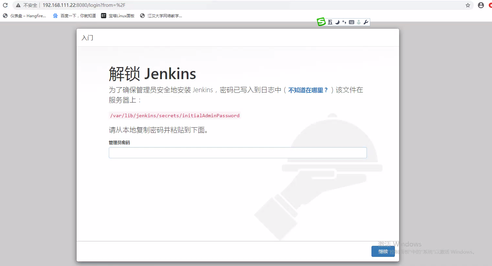

# Jenkins

## 目录

[文档中心](https://www.jenkins.io/doc/)

[入门指南](https://www.jenkins.io/doc/tutorials/)

[安装Jenkins](https://www.jenkins.io/doc/book/installing/)

###### [Build a Java app with Maven](https://www.jenkins.io/doc/tutorials/build-a-java-app-with-maven/) 

#### Red Hat / CentOS

```
sudo wget -O /etc/yum.repos.d/jenkins.repo \
    https://pkg.jenkins.io/redhat-stable/jenkins.repo
sudo rpm --import https://pkg.jenkins.io/redhat-stable/jenkins.io.key
sudo yum upgrade
sudo yum install jenkins java-1.8.0-openjdk-devel
sudo systemctl daemon-reload
```


##### Start Jenkins

You can start the Jenkins service with the command:

```
sudo systemctl start jenkins
```

You can check the status of the Jenkins service using the command:

```
sudo systemctl status jenkins
```

If everything has been set up correctly, you should see an output like this:

```
Loaded: loaded (/etc/rc.d/init.d/jenkins; generated)
Active: active (running) since Tue 2018-11-13 16:19:01 +03; 4min 57s ago
...
```

If you have a firewall installed, you must add Jenkins as an exception. You must change `YOURPORT` in the script below to the port you want to use. Port `8080` is the most common.

```
YOURPORT=8080
PERM="--permanent"
SERV="$PERM --service=jenkins"

firewall-cmd $PERM --new-service=jenkins
firewall-cmd $SERV --set-short="Jenkins ports"
firewall-cmd $SERV --set-description="Jenkins port exceptions"
firewall-cmd $SERV --add-port=$YOURPORT/tcp
firewall-cmd $PERM --add-service=jenkins
firewall-cmd --zone=public --add-service=http --permanent
firewall-cmd --reload
```

##### Initialize Jenkins

初始化jenkins



找到初始化密码


安装推荐的插件


创建管理用户


配置Jenkins Url(如果需要发送webhook,必须配置外网映射地址)


##### Installing Blue Ocean

Blue Ocean can be installed using the following methods:

- As a suite of plugins on an [existing Jenkins instance](https://www.jenkins.io/doc/book/blueocean/getting-started/#on-an-existing-jenkins-instance), or
- As part of [Jenkins in Docker](https://www.jenkins.io/doc/book/blueocean/getting-started/#as-part-of-jenkins-in-docker).

###### On an existing Jenkins instance

When Jenkins is installed on most platforms, the [Blue Ocean plugin](https://plugins.jenkins.io/blueocean) and all its other dependent plugins (which form the Blue Ocean "suite of plugins") are not installed by default.

To install the Blue Ocean suite of plugins on an existing Jenkins instance, your Jenkins instance must be running Jenkins 2.7.x or later.

Plugins can be installed on a Jenkins instance by any Jenkins user who has the **Administer**permission (set through **Matrix-based security**). Jenkins users with this permission can also configure the permissions of other users on their system. Read more about this in the [Authorization](https://www.jenkins.io/doc/book/managing/security/#authorization)section of [Managing Security](https://www.jenkins.io/doc/book/managing/security).

To install the Blue Ocean suite of plugins to your Jenkins instance:

1. If required, ensure you are logged in to Jenkins (as a user with the **Administer** permission).

2. From the Jenkins home page (i.e. the Dashboard of the Jenkins classic UI), click **Manage Jenkins** on the left and then **Manage Plugins** in the center.

3. Click the **Available** tab and type `blue ocean` into the **Filter** text box, which filters the list of plugins to those whose name and/or description contains the words "blue" and "ocean".

   

4. Select the **Blue Ocean** plugin’s check box near the top of the the **Install** column and then click either the **Download now and install after restart** button (recommended) or the **Install without restart** button at the the end of the page.
   **Notes:**

   - There is no need to select the check boxes of the other plugins in this filtered list because the main **Blue Ocean** plugin has other plugin dependencies (constituting the Blue Ocean suite of plugins) which will automatically be selected and installed when you click one of these "Install" buttons.
   - If you chose the **Install without restart** button, you may need to restart Jenkins in order to gain full Blue Ocean functionality.

Read more about how to install and manage plugins in the [Managing Plugins](https://www.jenkins.io/doc/book/managing/plugins) page.

Blue Ocean requires no additional configuration after installation, and existing Pipelines projects and other items such as freestyle projects will continue to work as usual.


Be aware, however, that the first time a [Pipeline is created in Blue Ocean](https://www.jenkins.io/doc/book/blueocean/creating-pipelines) for a specific Git server (i.e. GitHub, Bitbucket or an ordinary Git server), Blue Ocean prompts you for credentials to access your repositories on the Git server in order to create Pipelines based on those repositories. This is required since Blue Ocean can write `Jenkinsfile`s to your repositories.

#### Downloading and running Jenkins in Docker

1. Open up a terminal window.

2. Create a [bridge network](https://docs.docker.com/network/bridge/) in Docker using the following [`docker network create`](https://docs.docker.com/engine/reference/commandline/network_create/) command:

   ```
   docker network create jenkins
   ```

3. Create the following [volumes](https://docs.docker.com/storage/volumes/) to share the Docker client TLS certificates needed to connect to the Docker daemon and persist the Jenkins data using the following [`docker volume create`](https://docs.docker.com/engine/reference/commandline/volume_create/) commands:

   ```
   docker volume create jenkins-docker-certs
   docker volume create jenkins-data
   
   ```

4. In order to execute Docker commands inside Jenkins nodes, download and run the `docker:dind` Docker image using the following [`docker container run`](https://docs.docker.com/engine/reference/commandline/container_run/) command:

```shell
docker container run --name jenkins-docker --restart always --detach --privileged --network jenkins --network-alias docker --env DOCKER_TLS_CERTDIR=/certs --volume jenkins-docker-certs:/certs/client --volume jenkins-data:/var/jenkins_home --volume "%HOMEDRIVE%%HOMEPATH%":/home docker:dind
```

5. Run the `jenkinsci/blueocean` image as a container in Docker using the following [`docker container run`](https://docs.docker.com/engine/reference/commandline/container_run/) command (bearing in mind that this command automatically downloads the image if this hasn’t been done):

```sh
docker container run --name jenkins-blueocean --restart always --detach --network jenkins --env DOCKER_HOST=tcp://docker:2376 --env DOCKER_CERT_PATH=/certs/client --env DOCKER_TLS_VERIFY=1 --publish 8880:8080 --publish 50000:50000 --volume jenkins-data:/var/jenkins_home --volume jenkins-docker-certs:/certs/client:ro jenkinsci/blueocean
```

##### Unlocking Jenkins

When you first access a new Jenkins instance, you are asked to unlock it using an automatically-generated password.

1. After the 2 sets of asterisks appear in the terminal/command prompt window, browse to `http://localhost:8080` and wait until the **Unlock Jenkins** page appears.

   

2. Display the Jenkins console log with the command:

   ```
   docker logs jenkins-tutorial
   ```

3. From your terminal/command prompt window again, copy the automatically-generated alphanumeric password (between the 2 sets of asterisks).

   

   

4. On the **Unlock Jenkins** page, paste this password into the **Administrator password** field and click **Continue**.

### 思维导图

[参考引用](https://www.jianshu.com/p/5f671aca2b5a)

