# MAVEN环境安装及IDEA项目配置

### 配置MAVEN环境

#### 下载、解压maven包

windows系统下载二进制压缩包：[Maven最新版下地地址](http://maven.apache.org/download.cgi)、[3.6版下载地址](https://archive.apache.org/dist/maven/maven-3/3.6.0/binaries/)

将下载压缩包保存到IDEA的安装目录(非必须，根据自己的习惯来选择目录),打开压缩包，选择里面的根路径进行解压。

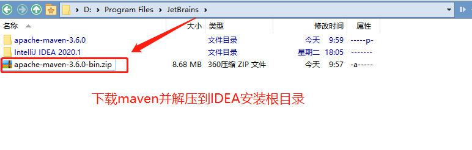
解压之后的文件目录如下：

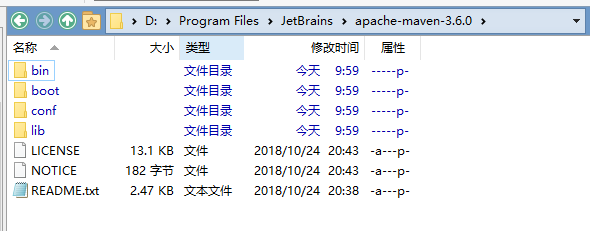


配置maven镜像地址和本地仓库路径 :

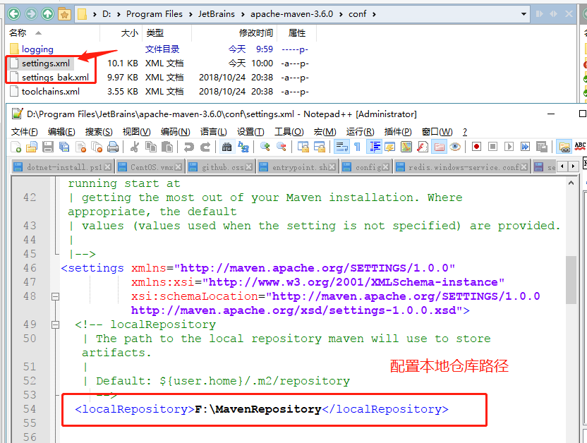


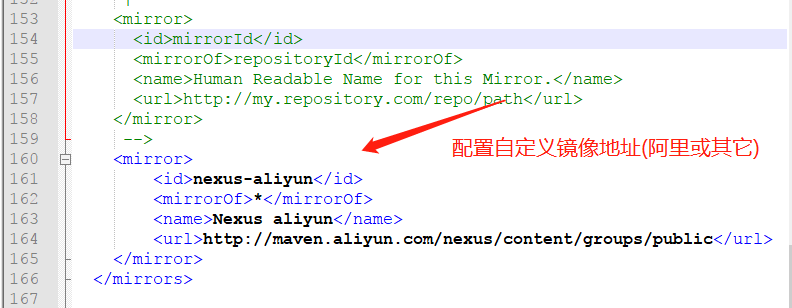

```xml
<mirror>
	    <id>nexus-aliyun</id>
	    <mirrorOf>*</mirrorOf>
	    <name>Nexus aliyun</name>
	    <url>http://maven.aliyun.com/nexus/content/groups/public</url>
	</mirror>
```


#### 配置系统环境变量

配置MAVEN_HOME

安装目录假设为：D:\maven\apache-maven-3.5.2，添加maven的环境变量，变量名为：MAVEN_HOM；值为：  D:\maven\apache-maven-3.5.2；

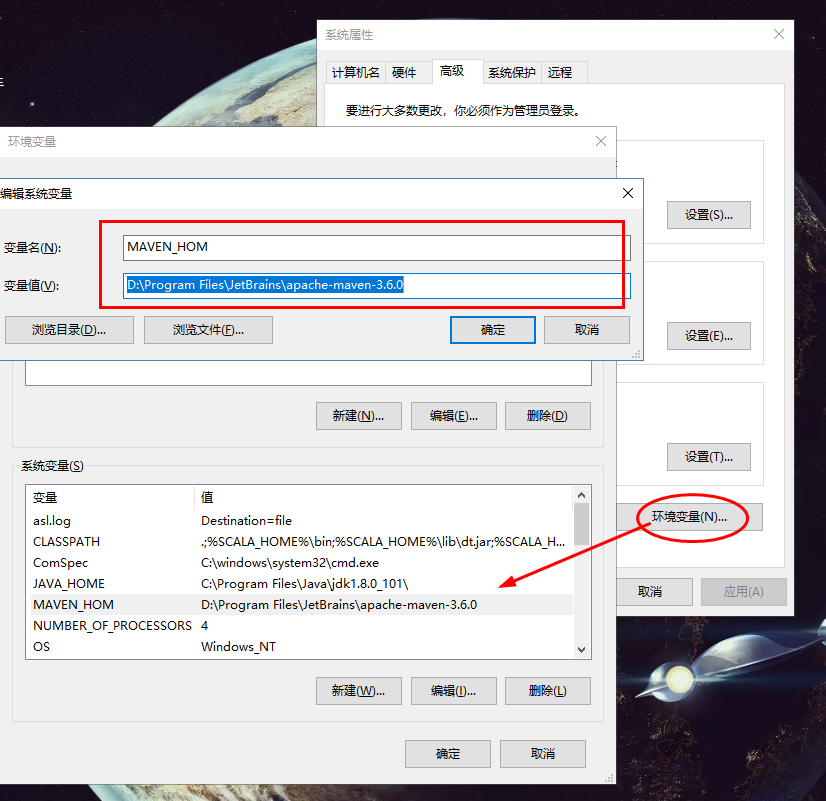
配置path变量，加上如下值：

`;%MAVEN_HOM%\bin;`

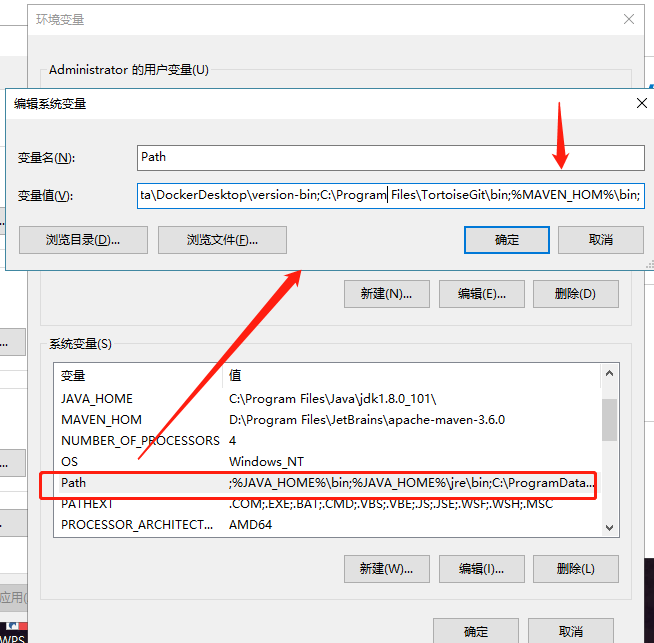


打开cmd输入mvn -v命令，查看maven环境变量是否生效

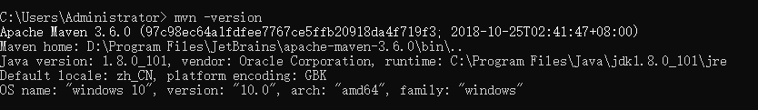


#### Maven查看配置变量命令：mvn help:system

```
	mvn help:system
```

该命令会打印出所有的Java系统属性和环境变量,并下载相关jar包;

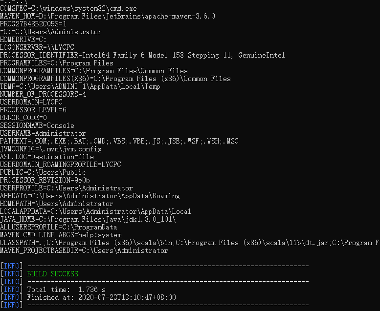


### IDEA全局配置

#### 配置 Maven主目录 

启动IDEA,打开界面右下角Configure菜单第1项Settings.

搜索Mavens配置，选择Build目录下的Maven,更改Maven主目录路径，选择之前解压的路径，以及配置路径，本地仓库路径会自动从配置文件加载

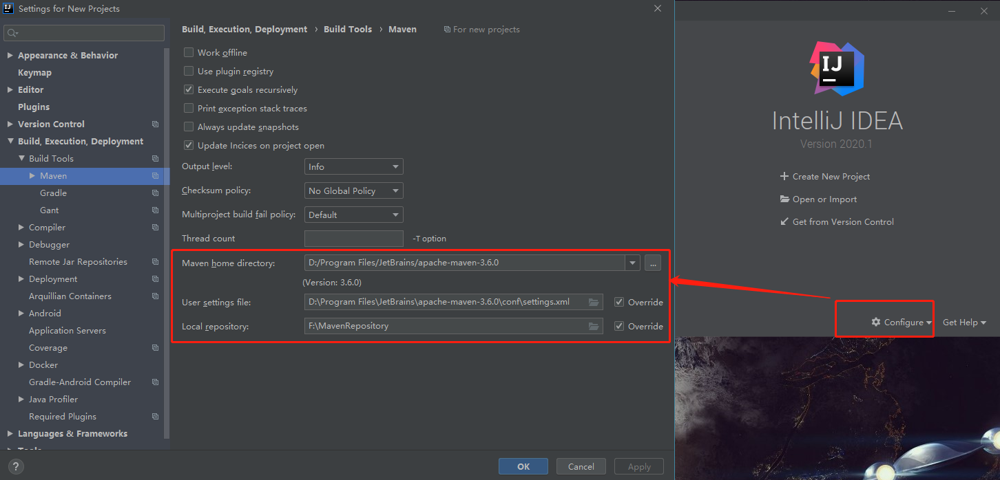

#### 配置项目JDK

启动IDEA,打开界面右下角Configure菜单第3项Structure for new Projects.

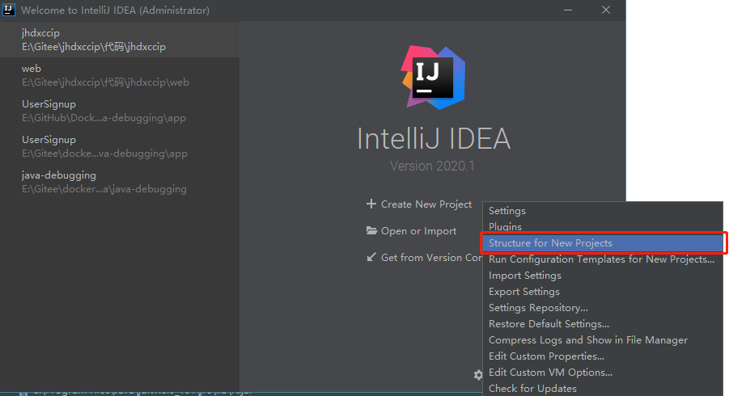


进入平台配置选择SDKs,添加1.8版本jdk，选择安装主路径即可

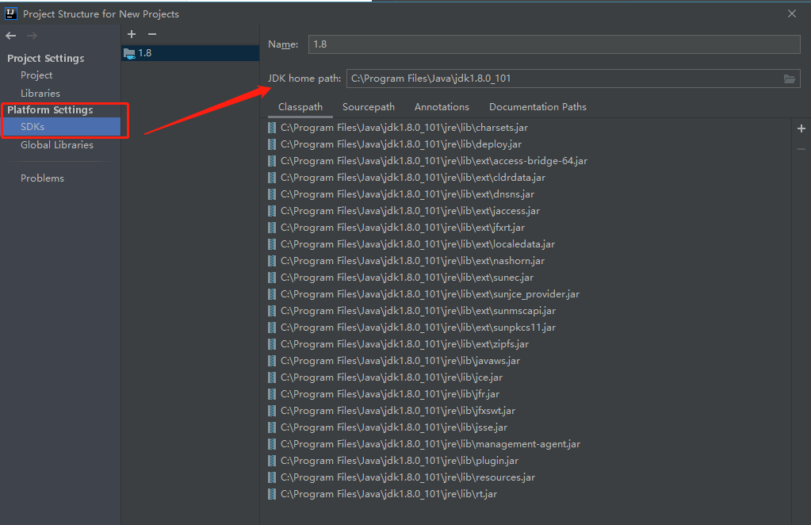


再选择Project配置，选择刚添加的1.8版本jdk

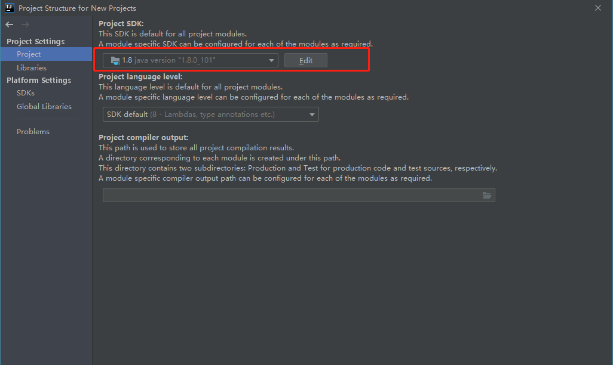


### 项目启动（Spring Boot)

#### 导入、构建项目

启动IDEA,选择Open or Import 菜单导入项目(提前将项目克隆到本地https://gitee.com/jldev/jianghan_university.git)

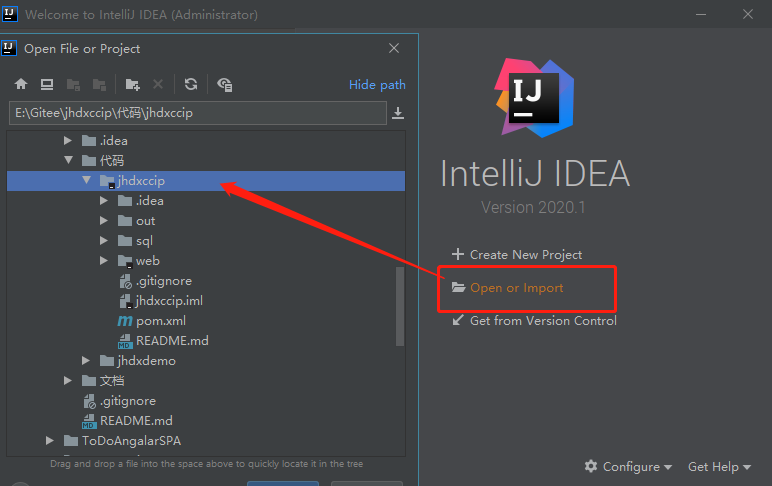


通过maven安装项目依赖包,进入IDEA,打开右侧maven工具窗口，点击Lifecycle--install，通过输出日志可以看到下载地址已经是之前配置的阿里仓库地址；依赖全部下载完成后，提示Build SUCCESS代表通过Maven构建成功，依次将其它模块进行构建(web模块).

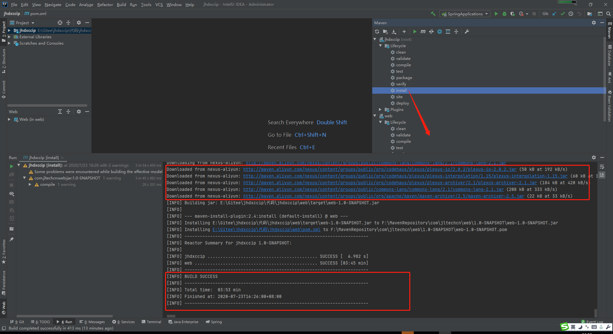

#### 配置web服务端口，Redis地址，Mysql地址账号

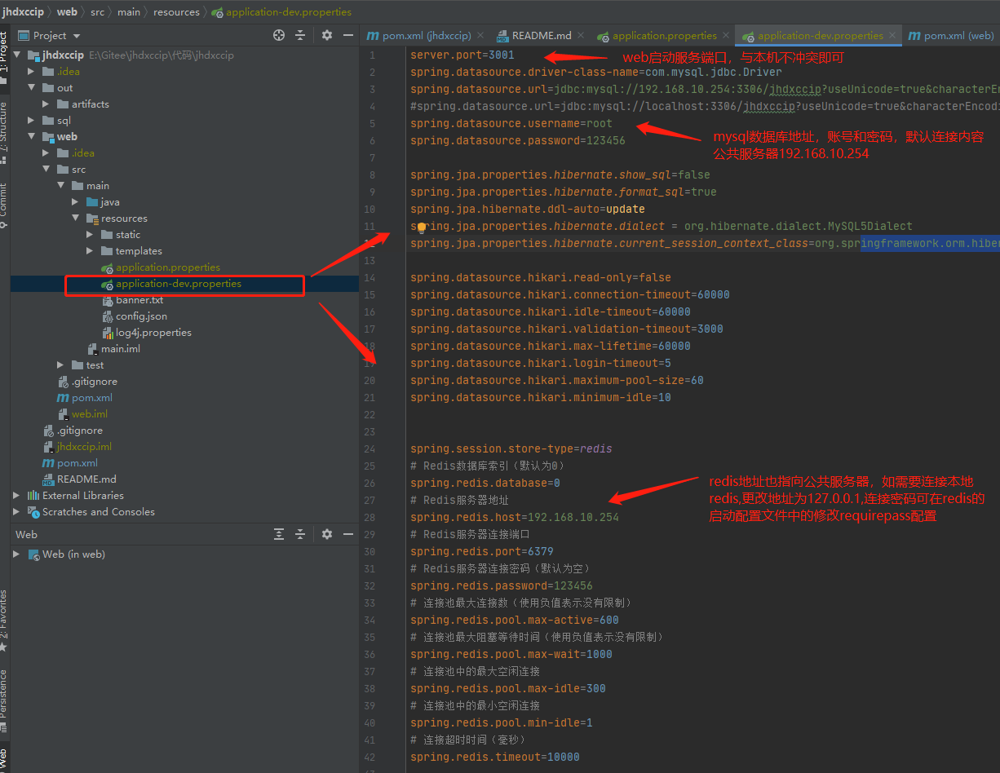

#### 启动IDEA Tomcat

配置完成之后,点击右上工具样启动按钮，运行项目。


等待一会，查看输出记录 [INFO] - Tomcat started on port(s): 3001 (http)，代表项目成功启动

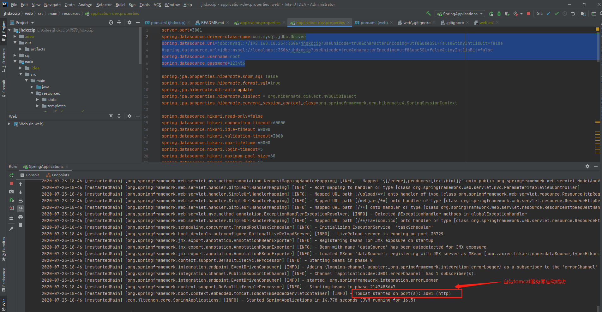

打开浏览器输入http://localhost:3001,页面正常打开。


